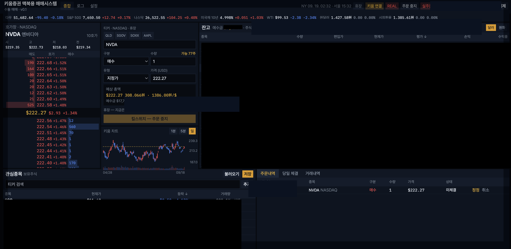

# Mac용 키움 REST API 기반 미국주식 수동매매 웹앱

**버전 0.2** — 이제 맥북·맥에서도 주식을 사고팔 수 있습니다.

키움증권 REST API를 이용하여 macOS에서 미국주식 시세·호가·잔고를 확인하고, 사용자가 직접 확인한 후 수동으로 주문할 수 있도록 만든 개인용 웹앱입니다.

본 프로젝트는 키움증권이 제공하거나 승인한 공식 HTS/WTS/MTS가 아니며, 키움증권과 제휴·협력 관계가 없습니다.

### 개인 사용 목적

본 프로젝트는 개발자 본인의 키움증권 계좌에서 개인적으로 사용하기 위해 개발한 프로젝트입니다. 제3자의 계좌 운용, 투자자문, 투자일임 또는 주문 대행을 목적으로 하지 않습니다.

지금은 **미국주식(나스닥·뉴욕·아멕스)** 을 먼저 만듭니다. 국내주식도 키움 REST API로 같은 방식(시세·호가·확인 후 수동 주문)이 가능하며, 이후 같은 구조로 붙일 수 있습니다.

`kiwoom_autotrading`을 뼈대로 만들었습니다. **자동매매 전략·조건 엔진은 넣지 않습니다.** 사람이 보고, 확인하고, 직접 내는 주문만 다룹니다.

- 개발 계획: [docs/개발문서.md](docs/개발문서.md)
- 사전 절차: [docs/사전절차.md](docs/사전절차.md)
- 문서 목록: [docs/README.md](docs/README.md)

## 꼭 읽고 쓰세요

본 프로젝트는 키움증권이 제공하거나 승인한 공식 HTS/WTS/MTS가 아니며, 키움증권과 제휴·협력 관계가 없습니다. 공식 단말을 대체하지 않습니다.

본 프로젝트는 개발자 본인의 키움증권 계좌에서 개인적으로 사용하기 위해 개발한 프로젝트입니다. 제3자의 계좌 운용, 투자자문, 투자일임 또는 주문 대행을 목적으로 하지 않습니다.

**호가·현재가는 HTS나 공식 WTS보다 늦을 수 있습니다.** REST·웹소켓을 거치므로 호가창 갱신, 체결 반영, 잔고 갱신이 영웅문보다 느릴 수 있습니다. 초단타·스캘핑처럼 밀리초 단위가 중요한 매매에는 쓰지 마세요. 빠른 호가가 필요하면 영웅문 HTS 또는 키움 공식 WTS를 쓰세요.

그 밖에:

- **실주문과 매매의 결과는 전부 본인 책임입니다.** 주문 실수, 지연, 오체결, 잔고 불일치, 프로그램 오류, 키 유출로 인한 손실도 개발자·이 저장소가 책임지지 않습니다. 수익을 보장하지 않습니다.
- **실주문은 최소 수량·최소 금액으로 먼저 테스트한 뒤에만 쓰세요.** 시세가 보인다고 바로 본격 매매하지 마세요. 지정가 1주 등으로 접수·체결·정정·취소가 영웅문과 맞는지 확인한 다음, 실제로 가동하는 것을 **강하게 권고**합니다.
- **기능이 제한적입니다.** 공식 단말의 차트 도구, 조건검색, 복잡한 주문 유형, 해외선물 등은 없습니다. 관심종목·호가·차트·잔고·기간 거래내역·수동 주문이 중심입니다.
- **실주문은 기본으로 꺼져 있습니다.** `KIWOOM_ORDERS_ENABLED=true`일 때만 키움으로 주문이 나갑니다. 켜기 전에는 목업입니다.
- **운영/모의 키와 모드를 섞지 마세요.** 헤더에 모드가 보이더라도, 실전 계좌로 착각해 주문하지 않도록 항상 확인하세요.
- **주문은 2단계 확인입니다.** 그래도 수량·가격·종목·시장(미국)을 다시 보고 내세요. 킬스위치는 신규 매수·매도를 막고 취소는 허용합니다. 오늘 안 쓰면 킬스위치만 켜 두지 말고 `Ctrl+C`로 웹앱을 끄세요. 이미 나간 미체결은 앱을 꺼도 키움에 남아 있습니다.
- **잔고·체결의 최종 기준은 키움 공식 단말입니다.** 이 앱과 숫자가 다르면 영웅문·공식 WTS를 우선하세요.
- **App Key / Secret은 `.env`에만 두고 Git에 올리지 마세요.** 공개 이슈·스크린샷에 계좌번호·키·잔고를 올리지 마세요.
- **로컬(127.0.0.1)에서 본인만 쓰는 전제입니다.** 인터넷에 포트를 열거나 다른 사람에게 키를 공유하지 마세요.
- 키움 계좌, 해외주식 거래 신청, OpenAPI 앱키가 있어야 동작합니다. 절차는 [사전절차.md](docs/사전절차.md)를 보세요.

## 범위

| | 0.2에서 |
| --- | --- |
| 시장 | 미국주식 우선. 국내주식은 같은 방식으로 가능하나 아직 구현하지 않음 |
| 주문 | 사람이 확인한 뒤 매수·매도·정정·취소 |
| 시세 | 현재가, 10호가, 일봉/분봉, 예수금·잔고, 당일 체결, 기간 거래내역 |
| 지수·환율 | 다우·S&P·나스닥 종합·국채 10년·WTI(거래소/선물). ETF 가격이 아님. 원달러는 키움 적용환율+시장환율 |
| 하지 않음 | 자동매매, 조건 스케줄러, 해외선물·옵션, Windows OCX |

시세·호가·차트·잔고는 키움입니다. 주문은 2단계 확인 후, `KIWOOM_ORDERS_ENABLED=true`일 때 키움으로 나갑니다.

## 맥에서 설치하기

Windows 영웅문(HTS)이나 OpenAPI+(OCX)는 **필요 없습니다.** 맥에 아래만 있으면 됩니다.

키움 계좌·해외주식 신청·앱키 발급은 [docs/사전절차.md](docs/사전절차.md)를 먼저 보세요. 키가 없으면 화면은 켜져도 시세·주문이 안 됩니다.

### 필요한 프로그램

| 프로그램 | 버전 | 용도 | 설치 |
| --- | --- | --- | --- |
| macOS | 최신 권장 | MacBook, 맥 미니, 맥 스튜디오 등 | — |
| Xcode Command Line Tools | 최신 | `git`, 컴파일 도구 | `xcode-select --install` |
| Homebrew | 최신 | 아래 프로그램 설치 (권장) | [brew.sh](https://brew.sh) |
| Python | **3.13 이상** | 백엔드(API) | `brew install python@3.13` |
| Node.js | **20 LTS 이상** | 프론트(화면) | `brew install node@20` |
| 브라우저 | Safari / Chrome 등 | 매매 화면 | 맥에 있는 것 |

확인:

```bash
git --version
python3 --version   # 3.13 이상
node -v             # v20 이상
npm -v
```

선택:

| 프로그램 | 용도 |
| --- | --- |
| [키움 CLI (`kwcli`)](https://github.com/Kiwoom-Securities/Kiwoom-REST-API) | 키가 먹히는지 터미널에서 확인. `brew install uv` 후 `uv tool install kwcli` |
| 영웅문S (아이폰/안드로이드) | 계좌 개설, 해외주식 신청, 환전, 체결 재확인 |
| Cursor / VS Code | 코드를 열어볼 때 |

설치하지 마세요: OpenAPI+(OCX), KOA Studio, OpenAPI-W, 32비트 Python. 전부 Windows·다른 상품용입니다.

### 1) 맥에 기본 프로그램 깔기

터미널(응용 프로그램 > 유틸리티 > 터미널)을 엽니다.

```bash
# 개발 도구 (git 포함). 이미 있으면 넘어갑니다.
xcode-select --install

# Homebrew. 안내가 끝나면 시킨 대로 PATH를 넣고 터미널을 다시 엽니다.
/bin/bash -c "$(curl -fsSL https://raw.githubusercontent.com/Homebrew/install/HEAD/install.sh)"

brew install python@3.13 node@20
```

Apple Silicon(M1/M2/M3/M4)에서 `python3`가 3.13이 아니면:

```bash
echo 'export PATH="/opt/homebrew/opt/python@3.13/libexec/bin:$PATH"' >> ~/.zprofile
echo 'export PATH="/opt/homebrew/opt/node@20/bin:$PATH"' >> ~/.zprofile
source ~/.zprofile
```

### 2) 이 저장소 받기

```bash
git clone https://github.com/chicago007/kiwoom_mac_trading.git
cd kiwoom_mac_trading
```

ZIP으로 받아 풀어도 됩니다. 이후 명령은 이 폴더 안에서 실행합니다.

### 3) 키움 키 넣기

```bash
cp .env.example .env
```

`.env`를 열어 본인 값을 넣습니다. **이 파일은 Git에 올리지 마세요.**

```
KIWOOM_MODE=real          # 모의면 demo
APP_KEY=                  # 운영 키
APP_SECRET=
APP_KEY_MOCK=             # 모의 키 (쓸 때만)
APP_SECRET_MOCK=

KIWOOM_ENABLED=true                 # 시세·호가·잔고를 키움에서 가져옴
KIWOOM_ORDERS_ENABLED=false         # true 일 때만 실제 주문이 나감. 처음엔 false
```

운영/모의 키는 서로 다릅니다. 처음에는 `KIWOOM_ORDERS_ENABLED=false`로 시세만 보고, 소액 주문을 확인할 때 `true`로 바꾸세요.

### 4) 실행

터미널 하나에서 API(8010)와 화면(3010)을 같이 켭니다.

```bash
chmod +x dev.sh   # 처음 한 번만
./dev.sh
```

브라우저에서 http://127.0.0.1:3010 을 엽니다.  
API 문서: http://127.0.0.1:8010/docs  
`Ctrl+C` 하면 둘 다 종료됩니다. 매매를 끝냈으면 킬스위치만 켜 두지 말고 이렇게 끄세요.

따로 켜려면:

```bash
# 터미널 1 — API
cd backend
source .venv/bin/activate
uvicorn app.main:app --reload --host 127.0.0.1 --port 8010 --timeout-graceful-shutdown 1
```

```bash
# 터미널 2 — 화면
cd frontend
npm run dev
```

막히면 [docs/사전절차.md](docs/사전절차.md) 체크리스트와 [docs/개발가이드.md](docs/개발가이드.md)를 보세요.

## 화면

첫 화면이 종합(`/`, `/trade`)입니다. 상단 지수·환율, 호가, 주문, 잔고, 관심종목, 주문내역/당일 체결/거래내역 탭. **종합2**(`/desk2`)는 관심·큰 차트·호가·주문을 한 줄로 둔 다른 배치입니다. 로그, 설정.



공개 캡처에서는 예수금·평가금액·주문번호를 가렸습니다.

## 버전

`VERSION`이 제품 버전입니다. 지금은 **0.2**이고 다음은 **0.21**부터 0.01씩 올립니다.

자세한 규칙: [docs/버전관리.md](docs/버전관리.md)
